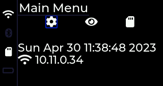

# Simple Application Framework for the Lilygo T-Embed ESP32S3

## T-Embed

See product here : https://www.lilygo.cc/products/t-embed

## License

Portions of this code are from the [Espressif ESP32 IDF](https://docs.espressif.com/projects/esp-idf/en/latest/esp32/COPYRIGHT.html) (SDK) which is licensed under Apache 2.0

Portions of this code are from the T-Embed examples at https://github.com/Xinyuan-LilyGO/T-Embed

The rest of the code is licensed under Apache 2.0

## Features

This is an example Application Framework for the T-Embed. It is intended to showcase
the capabilities of the product and provide a "toolkit" of parts to be repurposed
into your own application. It is _not_ a production ready application! Parts of this
codebase are derived from the ESP32 IDF, LVGL and Lilygo examples.

1. Build with ESP-IDF V5 for ESP32S3
1. Init CPU
1. Init LCD
   * Integrate LVGL for UI
1. Init LED strip
1. Init SDCard
1. Enable WiFi
   * Support WiFi AP scan and (limited) password entry
   * Support WiFi SMART configuration (use smartphone to configure WiFi)
1. SNTP to get time
1. Enable BLE and scan for Bluetooth devices. Note: Classic is NOT supported
1. Idle timeout for deep sleep, knob button for wakeup
1. Application Shell and UI
   * LVGL for widgets
   * Support Knob and button for navigation
   * Landscape UI shell with
     - Status icons [ Wifi, Battery (WIP), BT, SDCard ]
     - Title bar
     - Area for screen specific data
   * Included Screens
     - Main menu - Icons, IP Address, Time and Date
     - WiFi menu - Scan or SMART config
     - WiFi scan - Scan for AP, select AP, Enter password (limited)
       * ASCII upper/lower case only - No unicode
       * Space NOT included (Needs a font with an appropriate glyph)
       * Some special characters
       * Backspace only, no cursor
       * Enter password
     - WIFI SMART - Placeholder to display whilst WiFi is configuring
     - SDCard - Browse files on SDCard
     - Color test - Displays RGB on LCD
1. Support ESP serial Console for debug and screenshot

## Out of Scope

The following feature are out of scope for this project

* Extensive Unicode support. LVGL supports Unicode, but the effort to
  handle it is beyond this project
* Translations. There is no translation framework used in this project,
  although the set of strings is probably small enough that would be feasible
* Timezone and Daylight handling is not supported (yet). Hardcoded only timezone.
* Audio (I2S) IO
* Bluetooth Classic. The ESP32-S3 used in the T-Embed does not support this mode, only BLE

## Building and Installing

### Prerequisites

1. A T-Embed (preferably working)
2. An installation of the ESP-IDF V5.0 including ESP32S3 target
3. This repository
4. A working USB data and power cable

### Getting Started

0. Plug in your T-Embed. Make sure it is recognized by the OS (I recommend linux)
   - https://docs.espressif.com/projects/esp-idf/en/latest/esp32/get-started/establish-serial-connection.html
1. Clone the ESP-IDF repository V5.0 branch
   `git clone --depth=1 --recursive -b v5.0 https://github.com/espressif/esp-idf.git`
2. Run the `install.sh` in the ESP-IDF repo root `install.sh all`
3. Export the ESP-IDF config into the shell `. ./export.sh`
4. Check the IDF version `idf.py --version` (should be v5.0)
5. Clone this repo and change to where you have cloned it (I use `~/workspace/esp32/tembed`)
6. `idf.py set-target esp32s3`
7. `idf.py menuconfig` and set any options you need.
    The application comes with sensible default options set for the T-Embed and this application shell
8. `idf.py flash && idf.py monitor`

## Snapshots

Using the Console, you can take a snapshot of the screen and then generate a PNG from it.

1. Connect using `idf.py monitor | tee snap.log`
2. Navigate to the screen you want to capture
3. Type `snap<ENTER>` in the window with idf.py monitor
4. Watch a wall of data appear after a short delay
5. Use CTRL-] to exit monitor
6. Trim the file to just the one line containing the snapshot data (lots of 0000 digits)
8. Use `xxd` to convert the hex to bytes: `xxd -r -ps <snap.log >snap.raw` - the result should be 108800 bytes long *exactly*
9. Use the python script to convert the raw data to a png (requires python3 pillow library)
   `python3 rgb565_to_png.py`
10. Display the PNG with your favorite viewer or web browser
